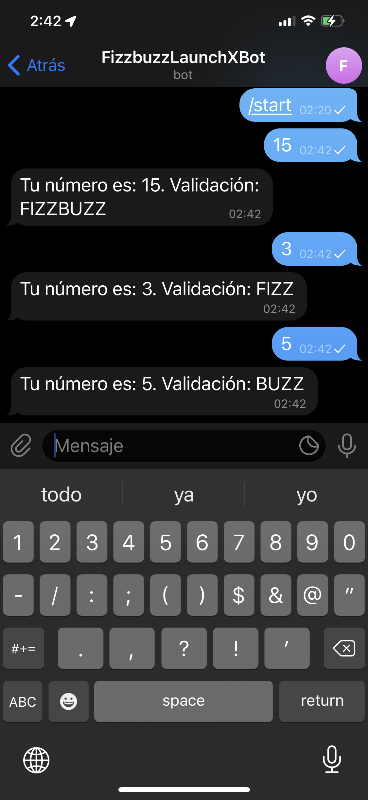
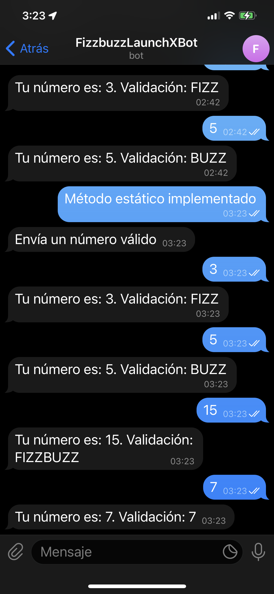
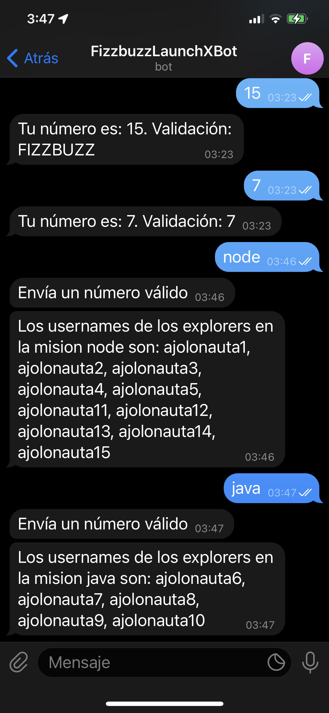

# Weekly Mission 5

Proyectos desarrollados en la semana 5:

| Proyecto | Práctica | Link al repo |
| ------------- |:-------------:| -----:|
|`Bot telegram`|1|[Link al repo](https://github.com/joslo2345/fizzbuzz)|
|`SQl`|2|[Link al repo](https://github.com/joslo2345/fizzbuzz)|
|`Prisma DB`|3|[Link al repo](https://github.com/joslo2345/misionjs_semana4_CodeChallenge)|
|`Cliente Servidor`|4|[Link al repo](https://github.com/joslo2345/misionjs_semana4_trellojs)  

Evidencias de la practica 1 'Bot Telegram':  

playbook/weekly_mission_5/src
src/botTelegramEvidencia1.PNG